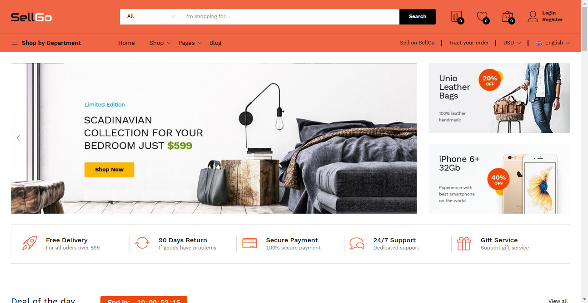
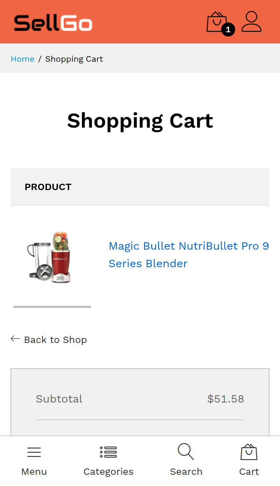
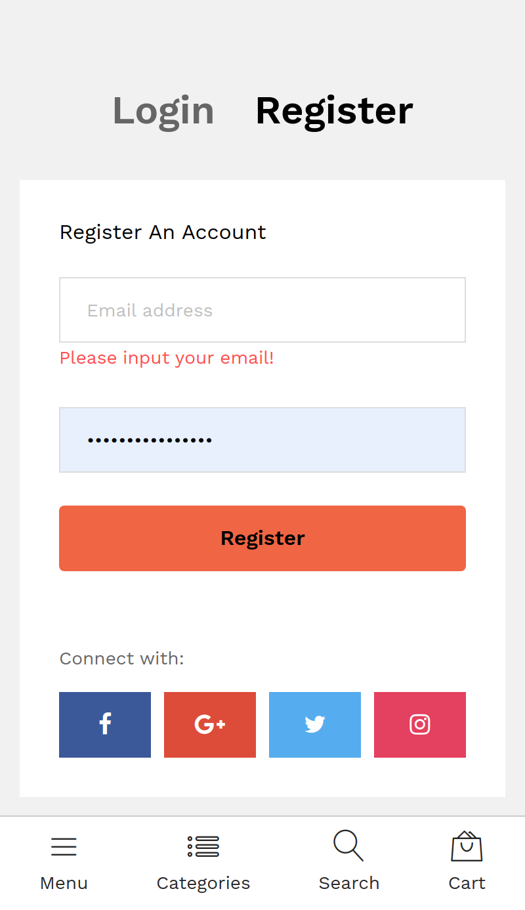
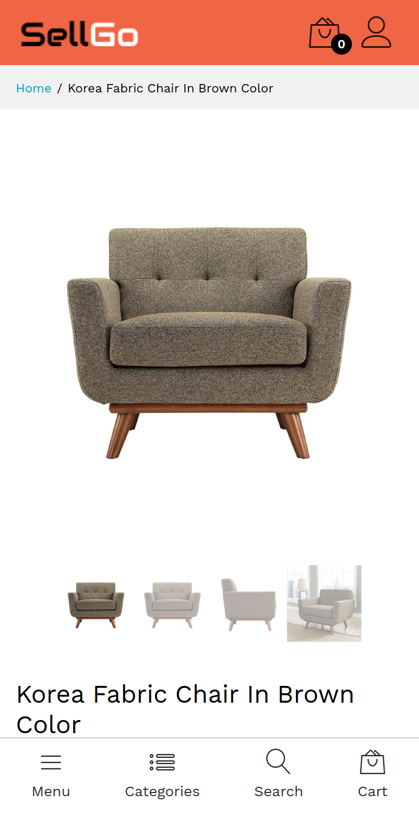
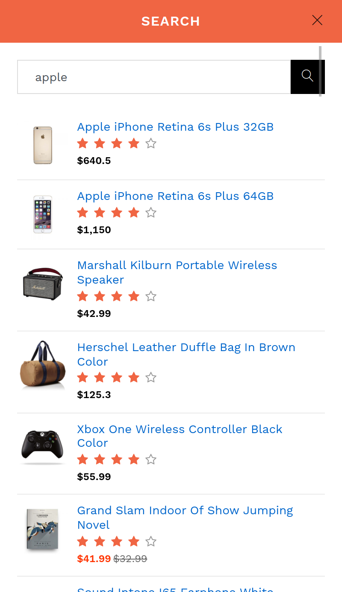

# SellGo

> An open-source ecommerce platform designed to provide a flexible and customizable solution for online retailers. Built on modern web technologies, it offers a range of features including **product catalog management**, **shopping cart functionality**, **order processing**, and **payment gateway integration**.

## A Screenshot of the Homepage

## Collective Screenshots of the Mobile Version

  
  
  
  

## A Demo for the App

- [Demo](https://serra.omarramoun.com/)

## Built With

- Languages: _**HTML5/Semantics, CSS3/SASS, JS/ES6**_
- Framework: _**React, Redux, Styled-Components, React-Router**_
- Technologies used: _**GIT, GITHUB, LINTERS**_

## Authors

👤 **Ramoun**

- **GitHub**: 
- **Twitter**: 
- **LinkdIn**: 

## 🤝 Contributing

Contributions, issues, and feature requests are welcome!

Feel free to check the [issues page](../../issues).

## Show your support

Give a ⭐️ if you like this project!

## Acknowledgments

- The team behind Synergey Of Serra (Great Guys)
- My Passion For Computers & TCG
